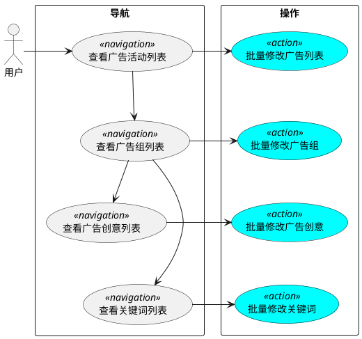

最近在为公司的产品做UX Refresh，我负责Shell Page，Router等基础框架等部分。虽然开源界已经有不少现成等产品可用，但由于产品本身的复杂性，我不得不思考用户场景背后隐藏的人机交互语言，并以此为模型，对现有开源库做谨慎的选择。

翻看了一些关于用户场景设计的文章，没有找到对这部分知识做系统阐述的，所以只能自己散乱的想了一些要点，记录下来，以待将来整理总结。

## 人机交互背后的语言
人与人交流的语言，有叙述，祈使，感叹等目标。但对于人机交互，祈使是唯一的目标。当然，这里排除了微软小冰之类的情感人工智能的交互场景。

就语法结构而言，祈使句隐含了主语（我），谓语（想要），直接宾语（你），而把重点放在了动宾结构的间接宾语上。所以祈使句可以表示为`Verb(Obj1, Obj2, Obj3, ...)`。其中动词`Verb`表示要让计算机做的动作，`Obj1`，`Obj2`，`Obj3`等，表示了动作的各个参数。

由于计算机操作的对象实际上是应用背后的数据模型，所以参数列表不能为空。用语法术语来说，就是`Verb`必须是及物动词。我们可以把参数分为两类，数据模型所定义的对象`Target`s，和描述动作本身的参数`Argument`s。于是用户的动作可以表示为`Verb(Target1, Target2, ..., Argument1, Argument2, ...)`。

> Note, 大部分动作有一个`Target`，在Ads Management的场景下，某个关键词的竞价参数，`关键词`就是`Target`，而参数，如`匹配方式`，`出价`，是`Argument`s。也有一些动作带有两个参数，比如关联某个受众类别到制定的广告活动，`受众类别`和`广告活动`是`Target`，`关联类型`(targeting/exclusion)是`Argument`。


我们在设计App的时候，每一个Use Case都可以转化为上述格式的动作。

> 这种抽象不但适用于数据管理应用，也适用于游戏和IoT控制。比方说，在星际争霸游戏里，让某个高阶圣堂武士施放心灵风暴魔法，被选中的`高阶圣堂武士单位`是`Target`，施放心灵风暴魔法是动作，魔法施放的`位置坐标`是`Argument`。
>
> 当我们对小米AI音箱说“打开空气净化器”时，`空气净化器`是`Target`，没有特别的`Argument`。

## GUI的用户交互
我们对人机交互语言做了抽象，那么我们设计GUI的目的就明确了，即通过鼠标，键盘，触屏等操作，提取出上述动作。

这种提取方法有两种，动词导向和对象导向。

### 动词导向的用户行为提取
用户先想到自己要做的动作，然后再选取相应的`Target`s和`Argument`s。典型的案例是各种现代编辑器中的`Ctrl+Shift+P`操作。适用与数据对象单一，但操作种类繁多的场景。代码编辑器的场景比较有代表性。Office产品传统的工具栏设计也属于此类。

### 对象导向的用户行为提取
先把用户导航到要操作的数据对象上，然后根据上下文提供相应的操作选项。适用与数据对象复杂的场景。大多数的数据管理App，以及Office的Contextual Ribbon都属于此类。我们的广告管理平台自然也采用这种模式。

当我们把用户导航到某个（些）数据对象上时，我们称这个（些）对象为上下文（Context）。当用户想要作出某个动作时，上下文会作为动作的某个`Target`自动带入。

于是我们的UI设计就分成两个层次

* 导航（Navigation），把用户带入某个上下文场景中。
* 操作（Action），在特定上下文中执行相应的操作。

实现层面的Use Case大概为一下形式


之后一篇我将基于对象导向对行为提取模式，对UI设计中对常见问题展开讨论。包括
1. 哪些Navigation Use Case是必要的
2. Tabs, Side Panel, Modal, Lightbox, Popup等UI元素应如何选取
3. 哪些页面应该是Routing可达的
4. 我们应该如何提取UI Component

