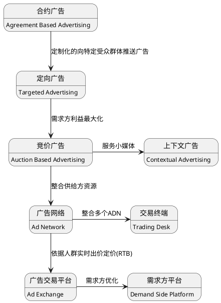

# 第一章 在线广告综述
## 术语
关键术语，及缩写打卡。
|术语|解释|
|---|---|
|大数据的4V特征|Volume（规模），Varity（多样性），Velocity（速度）和Value（价值）|
|Demand|需求方，广告主（Advertiser）或代理商（Agency）。|
|Supply|供给方，媒体（Media）或类媒体平台，流量的拥有者。|
|Audience|受众|
|Brand Awareness|品牌广告|
|Direct Response|直接效果广告|
|ROI|Return on investment. 投入产出比。|
|GD|Guaranteed Delivery. 担保式投送|
|CPM|Cost per Mille. 千次展示付费|
|GSP|Generalized Second Price. 广义第二高价|
|ADN|Ad Network. 广告网络|
|CPC|Cost per Click. 按点击付费|
|RPM|Revenue per Mille. 千次展示收益|
|TD|Trading Desk. 交易终端|
|RTB|Real Time Bidding. 实时竞价|
|ADX|Ad Exchange. 广告交易平台|
|DSP|Demand Side Platform. 需求方平台|

## 广告的目的
第一章思考题
||品牌广告(Brand awareness)|直接效果广告(Direct response)|
|---|---|---|
|目标|快速接触大量用户，宣传品牌形象|购买转化|
|投放周期|短|长|
|效果周期|中长期|立刻|
|重视指标|Impression|Conversion|

## 广告创意类型
|英文名|中文名|目标倾向（个人见解）|
|---|---|---|
|Banner Ad|横幅广告|品牌|
|Textual Ad|文字链广告|效果|
|Reach Media Ad|富媒体广告|品牌|
|Vedio Ad|视频广告|品牌|
|Social Ad|社交广告|效果|
|Mobile Ad|移动广告|品牌（如开屏广告）/效果（如推荐墙）|
|EDM (Email direct marketing)|邮件定向营销广告|效果|

## 发展简史
