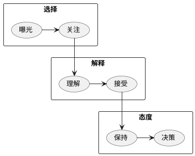

# 第二章 计算广告基础
## 术语
关键术语，及缩写打卡。

|术语|解释|
|---|---|
|eCPM|expected Cost Per Mille, 千次展示期望收入|
|CTR|Click Through Rate, 点击率|
|CVR|Conversion Rate, 转化率|
|CPC|Cost Per Click, 按点击结算|
|CPS|Cost Per Sale, 按订单数结算|
|CPA|Cost Per Action, 按转化行为数结算|
|CPT|Cost Per Time, 按时间结算|
|IAB|Interactive Advertising Bureau, 交互广告局|
|VAST|digital Video Ad Serving Template, 视频广告标准|
|OpenRTB|通用实时竞价接口标准|
|4A|American Association of Advertising Agency, 美国广告代理协会|
|ANA|Association of National Advertisers, 美国国家广告商协会|

## 信息接受过程
三阶段，六步骤。

__越靠前，对点击影响越大，越靠后，对转化影响越大。__


## 互联网广告的技术特点
1. 技术和计算导向
2. 效果可衡量性
3. 创意和投放方式的标准化
4. 媒体概念的多样化
5. 数据驱动的投放决策

## 计算广告的核心问题
Find the best match between a given user in a given context and a suitable advertisement.

简言之，就是`<Supply, Audience> -> <Demand>`的优化匹配问题。
给定场景与受众，优选最佳的广告。

### 在线广告产生效果的步骤
```plantuml
rectangle 媒体 {
  rectangle 展现页
}

rectangle 广告主网站 {
  rectangle 落地页
  rectangle 转化页
}

展现页 -r-> 落地页 : 点击
落地页 -r-> 转化页 : 转化
```

### 结算方式
|结算方式|点击率预估|点击价值预估|优缺点|适用场景|
|---|---|---|---|---|
|CPT|需求方|需求方|可以充分发挥橱窗效应<br>无法利用受众定向技术|高曝光的品牌广告|
|CPM|需求方|需求方|可以利用受众定向选择目标人群<br>合约售卖下，受众划分不能过细|1. 有受众选择需求的品牌广告<br>2. 实时竞价广告交易|
|CPC|供给方|需求方|可以非常精细的划分受众人群<br>比较合适的需求方和供给方分工|竞价广告网络|
|CPS<br>CPA<br>ROI|供给方|供给方|需求方无任何风险<br>供给方运营难度较大|1. 效果类广告联盟<br>2. 效果类DSP|

## 在线广告商业协会
|协会|利益方|代表成员|
|---|---|---|
|IAB|供给方|Google, Facebook, Yahoo!, Microsoft|
|4A|品牌广告代理商|奥美，智威汤逊，麦肯|
|ANA|需求方|AT&T, 宝洁, NBA|

## 思考题
> __Q:__ CPA/ROI的结算方式看似对广告主有利，实际也催生了一些变形的推广方式。
> 请考察你接触到的CPA/ROI渠道，并研究其与CPM或CPC渠道的关键差异。
>
> __A:__ 按CPS/CPA/ROI结算，需要需求方按供给方的要求建立Tracking转化的机制。
> 如果转化率过低，广告被展示的机会会减少，仍不符合需求方的利益。
> 怀疑书中的描述有误，难度较大的应该是供给方的运营。一般广告主会委托专业的代理公司
> 运营此类广告。

> __Q:__ 对广告产品而言，优化利润与优化ROI有什么区别？
>
> __A:__ 不同计费类型的广告，优化利润的方式是不同的。
> * 按CPS/CPA/ROI结算的产品，优化利润与优化ROI是一致的。
> * 按CPT结算的广告，优化利润重在
>   * 最大化广告时间
>   * 选择单位时间付费更高的广告
> * 按CPM结算的广告，优化利润重在选择竞价较高的广告
> * 按CPC结算的广告，优化利润重在优化点击率

> __Q:__ 在社交网络中发生的传播营销过程与典型的展示、点击、转化流程有很大不同，
> 请对此建立一个合理的模型，并分析其中的关键量化指标。
>
> __A:__ **[TODO]**